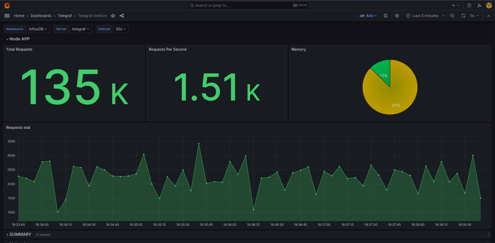
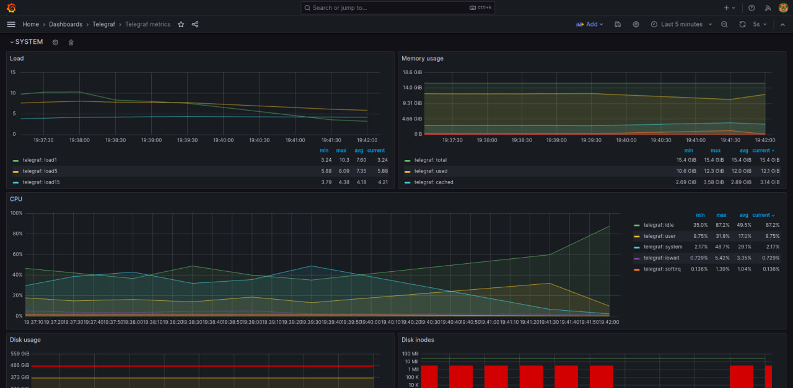
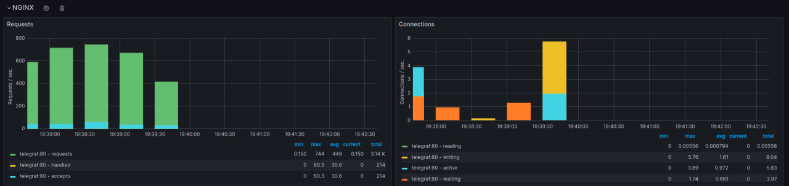

## Running

To run this project type this command:

```bash
  docker-compose up -d
```

## Load/Requests generation

Load generation script is already a part of docker-compose. 

It will make from 1000 to 10000 requests concurrently after 15 seconds on startup.

You can change the settings in file called `./ab/ab.sh`.

## Demo

Wisit [http://localhost:3000](http://localhost:3000) to see all of the graphs.

Login: `admin`
Password: `admin`

## Examples

### Path to the graphs:


### Node.js app metrics example graph:



### System metrics example graph:



### Nginx metrics example graph:

